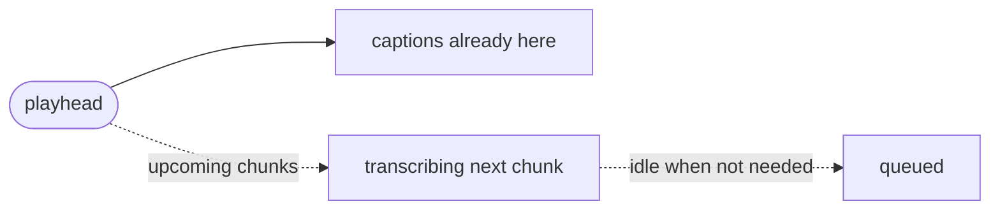
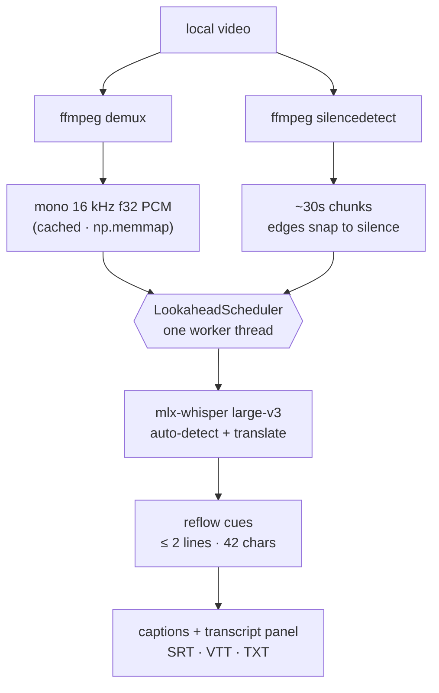

<div align="center">

# overhear-subs

**Subtitles that pull up before you do.**

Play a local video — the words are already on screen when the scene reaches them.

[](https://github.com/sharathkrml/overhear-subs)
[](pyproject.toml)
[](#quickstart)
[](LICENSE)

</div>

---

## The idea

> Transcribe what's **about to play**, before you get there.



An 88-second clip is cut into 3 chunks. At `playhead = 0`, **one** is transcribed. The worker idles until the video catches up.

| Playhead | Scheduler |
| --- | --- |
| Playing | keeps the chunk you're about to hit in the queue |
| Paused | freezes the window, GPU rests |
| Rewound | re-serves from cache, never re-runs the model |

Everything stays on your machine. The only network hit is the one-time model download from Hugging Face.

---

## Pipeline



<details>
<summary><b>What each stage does</b></summary>

| Stage | Detail |
| --- | --- |
| **Demux** | `ffmpeg` → mono 16 kHz float32 PCM, cached by `path + size + mtime`. Loaded as `np.memmap`, so seeking is just `SAMPLE_RATE * seconds` — an array index. No decode-on-the-fly, no VAD. |
| **Chunking** | `plan_chunks` cuts ~30s windows; `silencedetect` (≥0.4s below −35 dB) nudges each edge up to ±6s so words never split mid-vowel. |
| **Scheduler** | One thread, one rule: transcribe the chunk the playhead is inside, plus the ones coming up soon after it, then rest. The chunk you're about to hit jumps the queue; the rest fills in progressively. |
| **Whisper** | `mlx-community/whisper-large-v3-mlx` on the Apple GPU. Built-in `task="translate"` renders any spoken language as English in a single pass. Full `large-v3`, not turbo — turbo silently ignores translation. |
| **Reflow** | `reflow_cues` splits long segments into ≤ 2 balanced lines (≤ 42 chars), re-timed proportionally. CJK hard-wraps. No 3rd line covering the actor's face. |

**Unplayable files.** The browser decides what plays and the extension lies. `probe_codecs` serves browser-safe files untouched; otherwise `PlaybackPrep` transcodes once to H.264/AAC in a background thread (hardware `h264_videotoolbox`) with a live progress bar. Failure isn't fatal — the original is served and the reason shown.

</details>

---

## Quickstart

Requires **macOS on Apple Silicon**, plus `ffmpeg` and `uv`.

```sh
brew install ffmpeg uv
make setup        # install deps
make run          # http://localhost:8000
```

Open <http://localhost:8000> → **Open Video…**. That's a native macOS panel, not a web upload — nothing is copied, nothing leaves the machine. First run downloads the model (~3 GB, one time); after that it's resident and offline.

---

## Controls

```text
play/pause · −10s · +10s · volume+mute · time · speed · CC · PiP · fullscreen
```

| Keys | Action | Keys | Action |
| --- | --- | --- | --- |
| `⌘O` | Open a video | `M` | Mute |
| `Space` / `K` | Play / pause | `0`–`9` | Jump to 0–90% |
| `←` / `→` | Seek 5s (`⇧` = 30s) | `Home` / `End` | Start / end |
| `J` / `L` | Seek 10s | `,` / `.` | Frame step (paused) |
| `↑` / `↓` | Volume | `<` / `>` | Playback speed |
| `C` | Toggle captions | `F` | Fullscreen |
| `P` | Picture-in-picture | `?` | Shortcut list |
| `Esc` | Cancel in-progress open | | |

Drag the timeline to scrub — it doubles as a pipeline meter, one cell per chunk. Click a transcript line to seek; **Copy** a line on hover or the whole transcript from the header.

---

## Configuration

| Variable | Default | Purpose |
| --- | --- | --- |
| `HF_TOKEN` | — | Hugging Face token (also `HUGGING_FACE_HUB_TOKEN`) |
| `LT_LOOKAHEAD` | `10.0` | minimum transcript runway (seconds) the worker keeps before pausing |
| `LT_CHUNK` | `30.0` | chunk length in seconds; shorter means a seek waits less for captions |
| `LT_TRANSLATE_MODEL` | `mlx-community/whisper-large-v3-mlx` | ASR repo (must be translate-capable) |
| `LT_REMUX` | `1` | convert unplayable files to browser-safe mp4 (`0` disables) |
| `LT_CACHE` | `~/.cache/overhear-subs` | derived PCM + remuxed mp4 |
| `PORT` | `8000` | server port (`make run` / `make dev`) |

Set them inline, or copy `.env.example` to `.env` — the Makefile includes it and
exports whatever's set, so `make run`, `make dev`, and `make test` all see it.
Only `make` loads `.env`; running `uvicorn` directly won't (use `uvicorn --env-file .env`).

```sh
HF_TOKEN=hf_xxx LT_LOOKAHEAD=15 make run
```

**One language profile:** Auto → English, single pass. Swap the model via `LT_TRANSLATE_MODEL`; `large-v3-turbo` won't work (it ignores `task="translate"`).

---

## Limits (the honest part)

- **How far ahead is approximate.** The worker keeps transcribing until the upcoming chunks are covered, so the runway follows chunk boundaries (~30s, `LT_CHUNK`) rather than landing on an exact number of seconds.
- **One video at a time.** `/media` serves the current file; opening another cancels what's in flight.
- **Cached conversions are re-probed** — a stale cache is discarded, not served.
- **File panel uses `osascript`** (`app.py:choose_file`). macOS may ask once to control System Events (only to bring the panel forward); denied = panel may open behind the browser. Non-macOS falls back to a path field.
- **Chunk planning re-runs `silencedetect`** on every open (fast, audio-only); PCM extraction is cached.
- **Settings are stateless** — volume, speed, captions and sidebar reset per session. No localStorage.

---

## Design & tests

UI follows Apple's fluid-interface guidance: feedback on pointer-*down*, 1:1 timeline tracking via `setPointerCapture`, translucent `backdrop-filter` chrome, tabular numerals on clocks. Honors `prefers-reduced-motion`, `prefers-reduced-transparency`, `prefers-contrast`, and `prefers-color-scheme`. Transcript rows are keyboard-reachable, transport fully labeled, every control has a focus ring.

```sh
make test    # chunk planning, scheduler, reflow, format detection — fake backend, no model/ffmpeg
make dev     # auto-reload        make run PORT=9000
make check   # byte-compile      make clean / make cache-clean
```

All Python goes through `uv` — no manual venv activation.

---

## License

[MIT](LICENSE) — do whatever, just keep the copyright notice.
